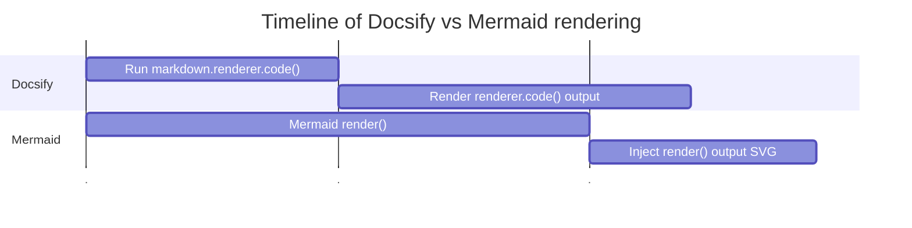
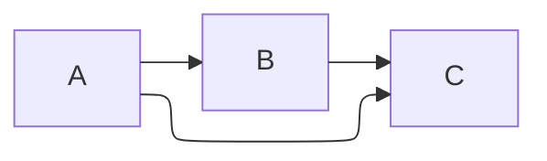
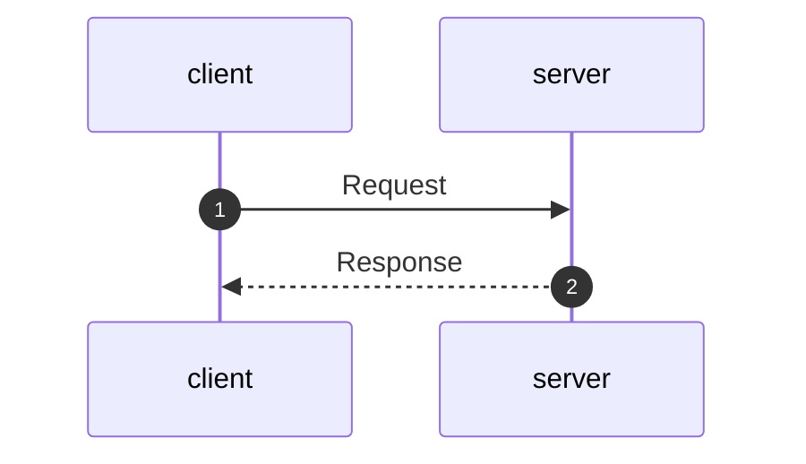

# Docsify Mermaid 10

Example with [Docsify](https://docsify.js.org) and [Mermaid 10](https://mermaid.js.org/).

## Running

- Run `npm install`
- Run `npm start`
- Open http://localhost:3000

## The problem

- Docsify doesn't support promises as return value of `markdown.renderer.code`.
- Mermaid rendering in v9 for `flowchart-elk` is async.
- Mermaid rendering in v10 for all diagrams is async (`mermaid.render` returns a Promise).

```js
window.$docsify = {
  markdown: {
    renderer: {
      code(code, lang) {
        if (lang === "mermaid") {
          return mermaid.render(`mermaid-svg`, code).then(({ svg }) => svg);
        }
        return this.origin.code.apply(this, arguments);
      },
    },
  },
};
```

Renders

```
[object Promise]
```

## The solution

1. Start Mermaid rendering
2. Docsify will run/render the returned elements (div, MERMAID_CONTAINER element)
3. Mermaid rendering completes
4. Our `.then` injects the generated SVG into the `MERMAID_CONTAINER` element



```js
let svgCounter = 0;

window.$docsify = {
  markdown: {
    renderer: {
      code(code, lang) {
        if (lang === "mermaid") {
          const svgName = `mermaid-svg-${svgCounter++}`;
          const MERMAID_CONTAINER_ID = `${svgName}-container`;
          mermaid.render(svgName, code).then(({ svg }) => {
            const containerElement = document.querySelector(
              `#${MERMAID_CONTAINER_ID}`
            );
            if (containerElement) {
              containerElement.innerHTML = svg;
            } else {
              console.error(`Error: #${MERMAID_CONTAINER_ID} not found`);
            }
          });
          return `<div class="mermaid" id="${MERMAID_CONTAINER_ID}"></div>`;
        }
        return this.origin.code.apply(this, arguments);
      },
    },
  },
};
```

## Demos

### Flowchart ELK

Super useful for large diagrams where regular flowcharts get messy with the default dagre (directed graph) rendering engine.

````md

````


### Sequence Diagram

````md

````


